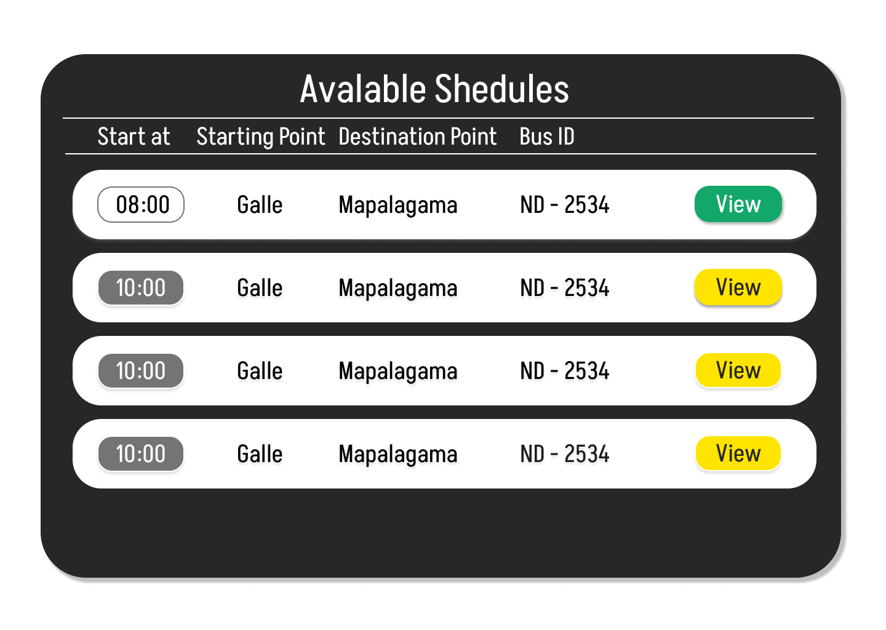

# Bus Tracking System


This project is a real-time bus tracking system built using Django, incorporating features like live location updates, schedule management, and user-friendly dashboards.

## Key Features

### Live Bus Tracking
   -  **Real-time Updates** 
      
      Track the precise location of buses on a map as they move along their routes. This feature is powered by GPS data sent from ESP32 IoT device installed on each bus. 
   - **Dynamic Visualizations**  
    
      Visualize bus movements on user-friendly dashboards, providing an intuitive understanding of their positions.

### Schedule Management
   - **Comprehensive Scheduling**  
   
      Define and manage detailed bus schedules, including:
      - **Routes** - Specify the paths buses take, including all stops.
      - **Timings** - Set departure and arrival times for each stop. 
      - **Stop Information** - Store relevant information about each stop on a route.
   - **Administrative Interface**  
   
      A dedicated interface for administrators to easily create, edit, and manage bus schedules.

### Enhanced Commuter Experience
   - **Estimated Arrival Times** 
   
      Provide commuters with accurate estimated arrival times for buses at their designated stops. 
   - **Real-time Notifications**  
   
      Implement push notifications to alert users about important updates:

      - **Bus Delays** 
          
          Notify commuters about unexpected delays, providing alternative options if possible.
      - **Estimated Arrival Times**

          Send timely reminders about bus arrivals at their selected stops.
      - **Service Disruptions**
      
         Inform users about any disruptions in service, such as route changes or cancellations. 

- **Location-Based Services**
   - **Distance Calculation**  
   
      Utilize the Google Maps API to accurately calculate distances between bus stops and user locations.
   - **Route Optimization**  
   
      Determine the most efficient routes for buses, considering factors like traffic conditions.
   - **Directions** 
   
      Provide step-by-step directions to users, guiding them to their nearest bus stops or destinations.

5. **Robust Backend and Integration**
   - **Django Framework:**  
   
      The backend is built using the Django web framework (Python), providing a scalable and reliable foundation for the system.
   - **Webhook Integration**  
   
      Seamlessly receive and process real-time data from external sources (ESP32 IoT devices) via webhooks. This ensures that the bus location data is constantly updated. 
   - **Database Management** 
   
      Store bus schedules, location data, user information, and other relevant information in a robust database like PostgreSQL.


## Project Structure


The project is structured into two primary Django applications:

**1.  *webhook* Application:**
   - **Purpose**  
   
      Serves as the entry point for all incoming data from the Arduino IoT devices. 
   - **Key Components**
      - **iotdevice View**
        -  This view acts as a webhook endpoint, receiving POST requests from the ESP32 devices. 
        -  It extracts important data:
            - GPS coordinates (latitude and longitude)
            - Route information
            - Bus ID
            - Connected status
        -  It processes the data and updates the database accordingly.

**2.  *dashboard* Application:** 
   - **Purpose**  Handles the user interface and logic for displaying bus information, schedules, and providing location-based services. 
   - **Key Components**
      - **tourdashboard View**
        
        

        Displays real-time information about a specific bus, including its location, status, last/next stops, and estimated arrival times.
      - **tourdetails View**

        
         Shows comprehensive details about a particular tour, including its scheduled times, available buses, and relevant information for commuters. 

       - **gettinglocations View**
        
          

          Allows users to input their starting point and destination. It then processes this information to provide relevant bus schedules and routes.
      - **avaialableshedules View**

        

          Displays a list of available bus schedules that match the user's selected route and desired time frame. 
  - **Functions:**
      - **getextractlocation Function**
         
         Processes user input for starting and destination points to determine the appropriate route and relevant locations.
      - **finding_nearest_shedule Function**

          Calculates and identifies the nearest scheduled bus based on the user's location, destination, and current time.
      - **finding_how_many_available_times Function**

          Determines and retrieves a list of available bus schedules that meet the user's criteria. 

## Data Flow

The system's data flow can be illustrated as follows:

1.  **Data Acquisition:**
    - ESP32 IoT device on each bus reads GPS data.
    - The device establishes a connection to the internet via WiFi.
    - At set intervals, it sends a POST request to the */iotdevice* webhook endpoint on the Django backend.
    - The request contains:
       -  JSON payload with GPS coordinates (latitude and longitude)
       -  Headers containing additional information:
           - Route number
           - Bus ID
           - Connection status 

2.  **Webhook Handling:**
    - The *iotdevice* view in the **webhook** app receives the data.
    - It parses the JSON payload and headers, extracting the necessary information.
    - The extracted data is then used to update the database with:
       -  The bus's current location (latitude and longitude)
       -  Active/inactive status
       -  Last recorded stop
       -  Next scheduled stop
       -  Timestamp of the update

3.  **Data Processing and Retrieval:**
    - The **dashboard** app utilizes various functions to process and retrieve relevant bus data:
       -  *getextractlocation* - Determines the route and bus stops based on user input. 
       -  *finding_nearest_shedule* - Finds the closest scheduled bus. 
       -  *finding_how_many_available_times* - Retrieves a list of available bus times.

4.  **Data Presentation:**
    - The processed data is sent to the appropriate Django templates to render dynamic and informative dashboards:
       -  *tourdashboard* -  Visualizes real-time bus location, status, and relevant schedule details.
       -  *tourdetails* - Displays comprehensive tour information.
       -  *shedules.html* :  Presents users with a list of available bus schedules based on their search criteria. 

## Technologies Used

### Backend
  - **Django** 
  
    Python web framework for building the backend infrastructure, handling URL routing, views, and data models.

  - **SQLite3** 
      
    A powerful and reliable open-source relational database management system used for storing bus schedules, locations, tracking data, and user information.

### Frontend
  - **HTML, CSS, JavaScript:**  
  
    The core technologies for building the user interface of the dashboards, forms, and other interactive elements. 

### Mapping and Location Services

  - **Google Maps API:**  
  
    Enables the display of maps, calculation of routes and distances, and estimation of travel times.
  - **Geopy:**  
  
    A Python library used to calculate geographical distances between coordinates, enhancing the accuracy of location-based calculations.

### **IoT and Communication:**
  - **ESP32:** 
  
    The microcontroller platform chosen for the IoT devices installed on buses, responsible for reading GPS data and communicating with the server.
  - **GPS Module:**  
  
    NEO-6M GPS Module module connected to the ESP32, enabling it to determine its geographical location (latitude and longitude). 
    
  - 

- **Arduino Libraries:**
  - **ArduinoJson:** 
    
    Used for encoding and decoding data in JSON format, enabling efficient communication between the Arduino device and the Django server. 


## Installation and Setup

1. **Clone the repository:**
   ```bash
   git clone https://github.com/yasanthaniroshan/Bus-Tracking-System.git
   cd Bus-Tracking-System/WebApp
   ```

2. **Create a virtual environment:**
   ```bash
   python3 -m venv .
   source bin/activate
   ```

3. **Install dependencies:**
   ```bash
   pip install -r requirements.txt
   ```

4. **Set up the database:**
   ```bash
   python manage.py makemigrations
   python manage.py migrate
   ```

5. **Run the development server:**
   ```bash
   python manage.py runserver
   ```

## Reviews and Feedback

Here are some reviews and feedback from users who have interacted with the Bus Tracking System:

[](https://www.youtube.com/watch?v=x9iSuZdkvp4)


[Here](https://tripetto.app/run/AJSCCAHERA) is the feedback form that used to collect feedback from users:


## Future Enhancements

- **User Authentication** 
  
  Allow users to create accounts and save their preferred routes and schedules.
- **Real-Time Notifications**  
  
  Implement push notifications to inform users about bus delays, estimated arrival times, and other updates.
- **Improved UI/UX** 

  Enhance the user interface and experience with more interactive features and visualizations.
- **Integration with Payment Gateways**  

  Allow users to purchase bus tickets directly through the platform.

## Contributing

Contributions are welcome! Please feel free to submit issues, feature requests, or pull requests.

## License


This project was originally initiated for [Finnc22 Competition](https://web.facebook.com/photo/?fbid=481549023661813&set=a.123543279462391) and is released under the [MIT License](../LICENSE).